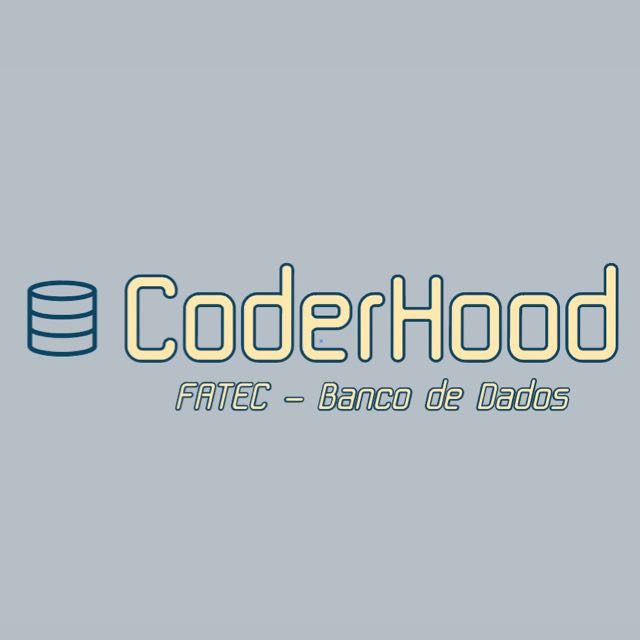
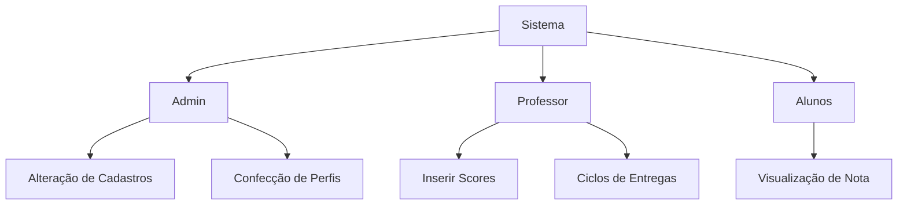

# ProjetoCoderHood

  

 

 |
    <a href="#objetivo">Objetivo</a> |
    <a href="#cronograma">Cronograma</a> |
    <a href="#requisitos">Requisitos</a> |
    <a href="#fluxos">Fluxos</a> |
    <a href="#wireframes">Wireframes</a> | 
    <a href="#backlog">Backlog</a> |

## Objetivo

* A instituição de ensino PBLTeX, especializada em cursos práticas de ensino aplicando PBL
(Problem Based Learning) costuma trabalhar com ciclos de desenvolvimento. Tais ciclos entregam scores parciais de seus alunos
que são usados no final para computar o chamado FEE (fator de ensino evolutivo). Contudo a
empresa não dispõe atualmente de um SI (sistema de informação) direcionado para a gestão e
acompanhamento dos scores de seus alunos.

  O desafio da CoderHood é apoiar a PBLTeX a levantar, especificar e desenvolver essa solução

## Cronograma

## Requisitos

### Requisitos Funcionais
* O SI deve possuir um controle de Turmas
* O SI deve possuir um controle de Grupos de Alunos
* O SI deve permitir um controle de Alunos
* O SI deve permitir a carga de Alunos
* O SI deve permitir um controle dos Ciclos de Entrega
* O SI deve permitir a carga de Scores parciais relacionados ao Ciclo de Entrega
* O SI deve permitir a Configuração de parâmetros globais
* O SI deve permitir a exportação de dados consolidados, computados e métricas 
inferidas
* O SI deve prover visibilidades objetivas e diretas que possibilitem o acompanhamento 
dos cursos providos pela PBLTeX

### Requisitos Não Funcionais

* Linguagem de programação Python e tecnologias relacionadas
* Uso de bases de dados simples, dentre as opções abaixo ou similares (alinhar com 
M2)
  * ZODB (https://zodb.org/en/latest/tutorial.html)
  * Arquivo (Text, CSV, JSON ou outros formatos)
  * Observação: Não DEVE ser usado SGBDs SQL e NoSQL no trabalho
* Sistema de controle de versão de código (Git)
* Documentações

## Fluxos

## Backlog

| ID  | User Stories |  Épico | Sprint 
| ------------- | ------------- | ------------- | ------------- |
| 1  | O usuário precisa **cadastrar as turmas** no sistema para que seja possível gerenciamento e acompanhamento dos alunos durante o processo de ensino   | Criação de Turmas  | [#1](https://trello.com/c/unBfxMw4/1-cadastrar-uma-turma)  | 
| 2  | Após criar a Turma, o administrador precisa **inserir alunos à turma**  .... | Content Cell  | 1  |
| 3  | Inserir história do ciclo de entrega e scores??    | Content Cell  | 1  |

| Content Cell  | Content Cell  |

## Wireframes

