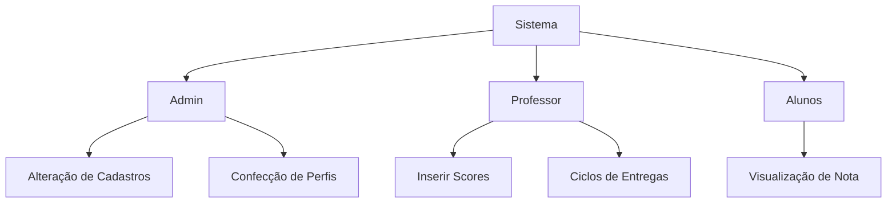

# ProjetoCoderHood

  

 

 |
    <a href="#objetivo">Objetivo</a> |
    <a href="#cronograma">Cronograma</a> |
    <a href="#requisitos">Requisitos</a> |
    <a href="#fluxos">Fluxos</a> |
    <a href="#wireframes">Wireframes</a> | 
    <a href="#backlog">Backlog</a> |

## Objetivo

## Cronograma

## Requisitos

## Fluxos

## Backlog

## Wireframes

