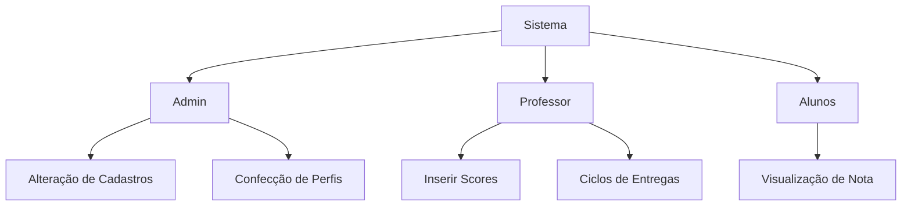

# ProjetoCoderHood

```mermaid
flowchart TD
A[Sistema] --> C[Admin] & B[Professor] & D[Alunos]
B --> E[Inserir Scores] & F[Ciclos de Entregas]
C --> G[Alteração de Cadastros] & H[Confecção de Perfis]
D --> I[Visualização de Nota]
```

Como um professor;

Eu preciso de um sistema que possibilite inserir Scores de alunos;

Para conseguir avaliar a evolução dos mesmos ao longo do curso 
