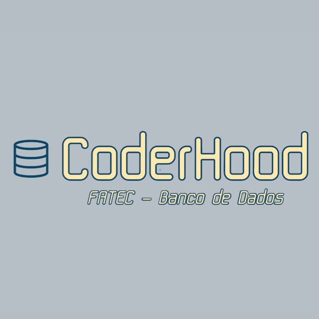

# ProjetoCoderHood

  

 

    
  
  
  
  
  
  
  
  
    

## Objetivo do 2º sprint

* Entregar um sistema que tenha capacidade de atender as funcionalidades básicas para atender o usuário (professor). As funcionalidades básicas foram: criação de turmas, criação de alunos e inserção de notas.  

## Backlog do 2º sprint

| Ranking de Prioridades | Prioridade | User Stories | Sprint | Status |
| ------------- | ------------- | ------------- | ------------- | ------------- |
| 1º | Alta |  **Tela de Acesso:** Tela que em princípio não terá validação, mas dará acesso à tela HOME.  | [#2]  |✔️| 
| 2º | Alta |  **Cadastrar turma:** O professor precisa cadastrar as turmas no sistema para que seja possível o gerenciamento e acompanhamento dos alunos durante o processo de ensino.  | [#2]  |✔️| 
| 3º | Alta | **Visualizar Turmas:** Ao cadastrar turma, será adicionado na tela um link com o nome da turma, que ao clicar, enviará o professor para a tela da turma. | [#2]  |✔️| 
| 4º | Alta | **Cadastrar Aluno:** O professor terá acesso ao cadastramento de alunos ao entrar na página das turmas. | [#2]  |✔️| 
| 5º | Média | **Visualizar Aluno:** O professor precisa visualizar os dados dos alunos (nome, RA) ao entrar na página da turma.  | [#2] |✔️| 
| 6º | Média | **Lançar Notas:** O professor precisa inserir as notas pros alunos para avaliá-los após a data final de um ciclo de entregas. | [#2] |✔️| 
| 7º | Alta | **Visualizar Notas:** O professor precisa visualizar as notas dos alunos, após uma inserção ou remoção de dados (notas).  | [#2] |✔️|

## Entrega do 2º Sprint

  

